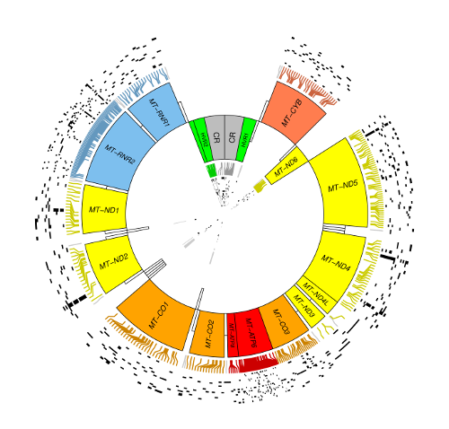
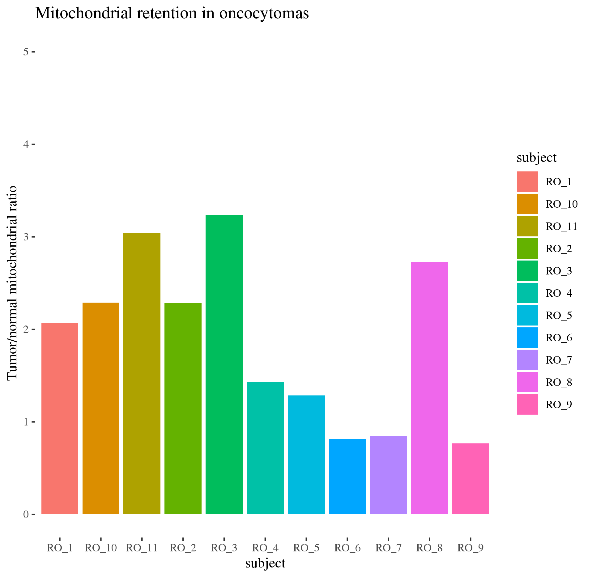
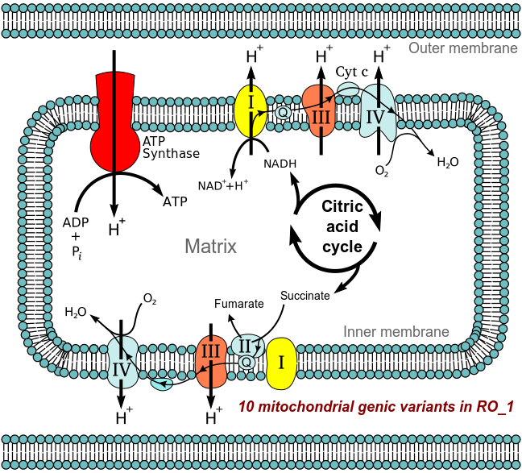

# MTseeker

MTseeker is a toolkit for mitochondrial variant analysis in the 
[Bioconductor](http://bioconductor.org/) environment. Given suitably aligned 
reads, it will call variants (and/or mitochondrial copy number), plot them for 
multiple samples, and provide basic functional annotation for coding variants.  If we were cool people, it would have a mitochondrion stuffed into a hexagon,
but we don't, so it doesn't... _yet_. 

[](https://travis-ci.org/trichelab/MTseeker/MTseeker)  [](https://codecov.io/gh/trichelab/MTseeker/MTseeker)

## How to install

```
devtools::install_github("trichelab/MTseeker")
# or:
install.packages("BiocManager")
BiocManager::install("trichelab/MTseeker")
```

## How it works

Visit the vignettes for more details, but suppose we have a bunch of renal 
oncocytomas (known to be driven early in development by mitochondrial mutations)
and matched adjacent normal kidney samples (let's call them "RO" and "NKS"). 

```{r}
MTreads <- getMT(BAMfiles)
```

The first and simplest thing we might like to do is get mitochondrial reads
from exome sequencing BAMs (or, really, any BAM -- it doesn't have to be any 
particular sequencing technology, though at present we support human mitogenomes
far better than any other organism). Above, the getMT function does that.

Now we might also like to estimate from the mt/nuclear read support what the 
rough ratio of mitochondria in the tumor tissue is compared to the normal
tissue. Since we track the read support for each upon load, we can use that:

```{r}
mVn <- Summary(MTreads)$mitoVsNuclear
names(mVn) <- names(MTreads) 
CN <- mVn[seq(2,22,2)]/mVn[seq(1,21,2)] 
mtCN <- data.frame(subject=names(CN), CN=CN)

library(ggplot2) 
library(ggthemes)
p <- ggplot(mtCN, aes(x=subject, y=CN, fill=subject)) + 
  geom_col() + theme_tufte() + ylim(0,5) + 
  ylab("Tumor/normal mitochondrial ratio") + 
  ggtitle("Mitochondrial retention in oncocytomas")
# ggsave("inst/extdata/mtCN.png") 
print(p) 
```


Now we probably want to call variants, and then plot them (filtered): 

```{r}
variants <- callMT(MTreads)
plot(filt(variants))
```

That looks like so: 


It would be nice to have some idea what this means for each patient:



More to come! But this is the basic idea. 

