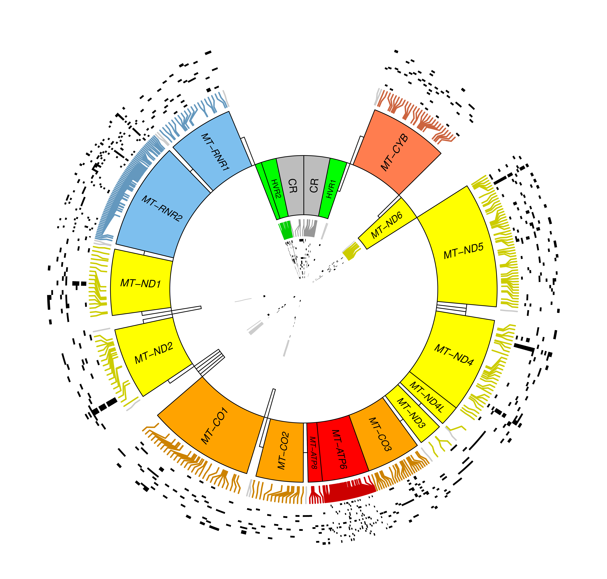

# Introduction

MTseeker works best when given some interesting mitochondrial data to work with.
Renal oncocytomas are great big pink cells that are jammed full of defective 
mitochondria, and sometimes progress to genomically unstable chromophobe renal
cell carcinomas (kidney cancer) in unlucky hosts. Nobody seems to be entirely 
sure what role mitochondrial variants play in their evolution, but the cells 
have thousands of mitochondria stuffed into them. So that's what we'll study.


# Loading data

First we needed to load the oncocytoma BAMs. You can do this using the following code, but you can also skip it and use the MTseekerData package. Notice that all of them have been aligned with BWA against the canonical rCRS mitogenome by splicing it 
into hg19. (As opposed to GRCh37, which is what we should have done... but
the point is that any modern GRCh assembly *or* a spliced rCRS contig works.)

## Download the oncocytoma bams from GitHub

```{r engine='bash', eval=FALSE}

# the repository can be downloaded and installed wherever you like
# it is worth noting that the bams here *only* contain the chrM reads
# the relative ratio of nuclear to mitochondria section of the tutorial will not work
git clone https://github.com/trichelab/oncocytomaBams.git

```

```{r loadLibrary}
library(MTseeker)
```

```{r loadBams, eval=FALSE} 
if (FALSE) { 
  # we use SamBlaster... a lot... in my lab.
  # however, this example takes a while even with SamBlaster. 
  # it is recorded here for posterity and also "how did you get that result". 
  # if they were aligned using BWA and samblaster with split and discordant read output
  BAMfiles <- grep("(split|disc)", value=T, invert=T, list.files(patt=".bam$"))
  #if you downloaded the git repo oncocytomaBams
  BAMfiles <- list.files("/path/to/the/oncocytomaBams",
                         pattern = ".bam$")
  names(BAMfiles) <- sapply(strsplit(BAMfiles, "\\."), `[`, 1)
  BAMs <- data.frame(BAM=BAMfiles, 
                     Sample_Group=ifelse(grepl("NKS", BAMfiles), 
                                         "normal","tumor"))
  rownames(BAMs) <- sub("NKS", "normal", sub("RO","oncocytoma", rownames(BAMs)))
  BAMs$subject <- as.integer(sapply(strsplit(as.character(BAMs$BAM), "(_|\\.)"), `[`, 2))

  # order things by subject
  BAMs <- BAMs[order(BAMs$subject), ]
  show(BAMs)

  library(parallel) 
  options("mc.cores"=detectCores()/2)
  MTreads <- getMT(BAMs)
  names(MTreads) <- sapply(strsplit(fileName(MTreads), "\\."), `[`, 1)
  rownames(metadata(MTreads)$cache) <- names(MTreads)
  saveRDS(MTreads, file="oncocytoma_and_matched_normal_MTreads.rds")
}

# We can proceed to variant calling, haplomasking, etc. from here
```

Since realigning 22 whole exomes and extracting/counting reads takes a while,
we created the MTseekerData package to hold the output from doing the above. 
The _RONKSvariants_ data object holds called variants (as an MVRangesList)
comparing _R_enal _O_ncocytomas and _N_ormal _K_idney _S_amples from 11 
subjects who developed this premalignant neoplasia of the kidney. Most such 
cases seem to be self-limiting, perhaps due to their defective mitophagy, and
they accumulate thousands of excess mitochondria with Complex I defects. If
these tumors do become malignant, they tend to turn into chromophobe renal
cell carcinomas, a type of kidney cancer that is characterized by aneuploidy 
of all or nearly all chromosomes. So the relationship between a self-limiting
oncocytoma and a genomically unstable carcinoma is thought to hinge at least 
in part on how the affected cell deals with metabolic derangement, and whether
that results in the accumulation of additional mutations (like _TP53_ in CRCCs).


```{r loadDataLibrary}
library(MTseekerData)
```

# Calling variants

Obviously it's not much good to have a variant caller that can't call variants,
so we demonstrate that here. (Note: tumor/normal calls, haplogroup inference,
and soft-backfiltering of haplogroup-determining variants are works in progress,
so we do not currently demonstrate them here, although the fpFilter datasets 
are useful for these purposes) MTseeker used to use the _gmapR_ package
for mitochondrial variant calling; now we provide cross-platform support via
Rsamtools::pileup. However, we provide a pre-called dataset to use here.

```{r loadVariants}
library(MTseekerData)
data(RONKSvariants, package="MTseekerData")
```

# Haplomasking ancestry-related variants

It's important to mask off ancestry-related variants for a variety of reasons, one of which being important to identify disease related variation as opposed to ancestry-related mitochondrial variation. To do this, we employ HaploGrep using the latest build of PhyloTree (e.g. 17). The process works by finding variants present that correspond to ancestry and building up a fasta representation of rCRS with the variants injected into it. If there exist overlapping ancestry-related variants, we pick the highest frequency mutation since we can only represent one in the fasta file. If both (or more) are equally frequent, we randomly pick one (for now). Finally, we call out to HaploGrep to infer the haplogroup and parse the returned variants corresponding to the inferred haplogroup.

```{r haplomask}

# this depends upon having java installed
# unfortunately, you need oracle java to have haplogrep run...
if (FALSE) {
  RONKSvariants <- haploMask(RONKSvariants, java.path = "/usr/bin/java")
} 


```

# Plotting variants

Let's filter out some of the common variants, to focus on those only seen in
the renal oncocytoma samples. The `filterMT` function drops samples with median
read depth less than 20x, and if requested, also drops variants that fall into 
known homopolymeric regions (fpFilter=TRUE) or have variant allele frequencies 
(VAFs) of less than 0.03, many or most of which are likely to be NuMT (nu-mite)
sequences that map equally well between nuclear and mitochondrial assemblies.

The coverage filter is somewhat gratuitous, since the shallowest mitochondrial
coverage in this study is 333x, but the false-positive filter and the NuMT 
filter are both a good idea in most studies. Additionally, variant calls that
are not marked as PASSing quality control are all dropped at this stage. The 
`granges` method for MVRanges and MVRangesList objects turns a set of variant
calls into a GenomicRanges object with the aggregated affected regions.

```{r filterRoVariants}
RO <- grep("RO_", names(RONKSvariants))
filtered_RO <- filterMT(RONKSvariants[RO], fpFilter=TRUE, NuMT=TRUE)
RO_recurrent <- subset(granges(filtered_RO), 
                       region == "coding" & rowSums(overlaps) > 1)
```

Same thing for the normal kidney samples, so that we can weed out a bit more. 
Again, we'll use the `granges` method to aggregate affected regions of chrM. 


```{r filterNksVariants}
NKS <- grep("NKS_", names(RONKSvariants))
filtered_NKS <- filterMT(RONKSvariants[NKS], fpFilter=TRUE, NuMT=TRUE)
NKS_recurrent <- subset(granges(filtered_NKS), 
                        region == "coding" & rowSums(overlaps) > 1)
NKS_gaps <- subset(gaps(NKS_recurrent), strand == "*")
```

Lastly, let's take only the variants in the oncocytomas that do not overlap
recurrent variants in the normal kidney samples, to simplify our plotting.

```{r pruneVariants}
RONKSfiltered <- endoapply(filterMT(RONKSvariants), subsetByOverlaps, NKS_gaps)
RONKScoding <- encoding(RONKSfiltered)
```

OK, now we have whittled away some of the more common variants to focus
on those that seem to be specific and recurrent in the oncocytomas. Let's
plot the resulting variants in the first few samples. The plot looks a bit 
like tree rings; each tree ring is one sample, and each black mark is a 
variant (of whatever minimum variant allele frequency, or VAF, enforced)
in a particular sample. The color-coded lines point to where on chrM the 
variant maps back to, since there are sparse and dense regions of variation.
For whatever reason, vignette builds fail if we plot all of the variants,
so we skip this step in the production vignette. (It _is_ done in the build!) 


```{r plotVariants, eval=FALSE}
plot(RONKScoding)
```

The resulting plot looks like so:



We are planning to add haplogroup inference and masking in an upcoming release
and the PhyloTree XML data prepared by the fine HaploGrep folks is part of 
MTseekerData for exactly this purpose. The interaction between haplogroups 
(inherited and ancestry-informative mitochondrial variant haplotypes) and 
germline or somatic variants, in both mitochondrial and nuclear genomes, is a 
topic of substantial research interest due to its clear metabolic implications.


# Plotting functional impacts

Now let's plot a cartoon of the putative functional impact in one patient (RO1):

```{r makeSVG}
data(RONKSvariants, package="MTseekerData")
SVG <- MTseeker::MTcomplex(RONKSvariants[[2]]) 
```

The above will bring up an image in a browser window like the one in the README.
You can also generate a PDF file of the modified rendering if you prefer:

```{r makePDF, eval=FALSE}
library(rsvg) 
tmppdf <- paste(tempdir(), "RO_1.functionalAnnot.pdf", sep="/") 
rsvg_pdf(tmppdf)
```

We might like to add a biohazard/mutagen symbol to complexes within the electron
transport chain (ETC) that are impacted by nonsynonymous variants, and this is 
in progress. The output is Scalable Vector Graphics (SVG) based on an image 
created and shared by Tim Vickers at Washington University in St. Louis. Any
suggestions regarding how to scale this visual up to populations of cells, 
people, or organisms are welcome; some components (such as in Complex II) have 
migrated to the nuclear genome in humans, while others are retained in mtDNA in 
humans but lost to nuclear genomes in other eukaryotes. Moreover, tendencies 
for particular diseases or conditions to hit particular complexes are of both
biological and medical interest, which is why we added this in the first place.

We hope you enjoy working with mitochondrial genomes as much as we have. Please
send an email to trichelab@gmail.com if you have comments or suggestions. 
